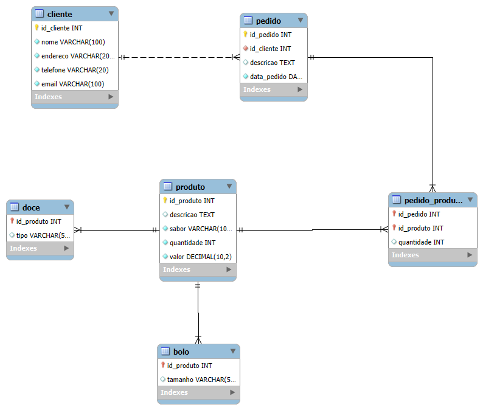

## 4. Projeto da Solução

Pré-requisitos: <a href="03-Modelagem do Processo de Negocio.md"> Modelagem do Processo de Negocio</a>

## 4.1. Arquitetura da solução

A arquitetura da aplicação proposta para o sistema de gestão da Santos Bolos e Doces é baseada em uma estrutura cliente-servidor simples, eficiente e moderna. A solução foi projetada para oferecer uma experiência responsiva e intuitiva aos usuários finais, enquanto permite à administradora controlar os pedidos, portfólio de produtos e dados de clientes.

Componentes e Tecnologias Utilizadas
📌 Front-End (Interface do Usuário)

- HTML5: estruturação das páginas web.

- CSS3 + Bootstrap: estilização e layout responsivo da interface.

- JavaScript: interatividade e manipulação do DOM no lado do cliente.

- Visual Studio Code: utilizado para codificação do front-end.

- GitHub Pages: responsável por hospedar o front-end de forma estática na web.

📌 Back-End (Lógica de Negócio e APIs)

- C#: linguagem para construção da API e implementação da lógica de negócio.

- Visual Studio: IDE usada para desenvolver, testar e depurar o backend.

- APIs RESTful: permitem a comunicação entre o front-end e o banco de dados.

📌 Banco de Dados

- MySQL: sistema de gerenciamento de banco de dados relacional que armazena informações como produtos, clientes e pedidos.

- SQL: utilizado para consultas, inserções e manipulação de dados.

- MySQL Workbench: ferramenta de modelagem e gerenciamento do banco.

📌 Infraestrutura e Controle de Versão

- Git: controle de versão para rastreamento de mudanças no código.

- GitHub: repositório remoto para versionamento colaborativo e hospedagem do front-end (via GitHub Pages).

Fluxo de Interação do Usuário com o Sistema

1 - O usuário acessa a aplicação via navegador, carregando as páginas HTML/CSS/JS hospedadas no GitHub Pages.

2 - Ao realizar uma ação (como realizar um pedido), o front-end envia requisições para o back-end desenvolvido em C#.

3 - O back-end processa a lógica, acessa o banco de dados MySQL por meio de SQL e retorna a resposta.

4 - A resposta é tratada e exibida dinamicamente ao usuário pelo JavaScript no navegador.

### 4.2. Protótipos de telas

O sistema foi projetado para proporcionar uma navegação simples e eficiente. As principais telas e funcionalidades são:

- Tela de Início: Apresenta o cardápio, os produtos são exibidos em cards, contendo imagem, nome e preço. Ao clicar em um item, um modal é exibido permitindo que o usuário escolha detalhes como sabor, tamanho ou tipo antes de adicionar ao carrinho. A tela também oferece acessos rápidos para login e para saber mais sobre a empresa.

- Tela de Login: Permite acesso ao sistema com opção de cadastro para novos usuários.

- Tela de Cadastro: Coleta dados essenciais para criar uma conta.

- Tela de Pedidos: Exibe pedidos cadastrados e permite ações como visualização ou edição.

- Tela Sobre: Apresenta informações sobre a plataforma e seu propósito.

## Diagrama de Classes

## Modelo ER

### 4.3. Modelo de dados

O modelo de dados apresentado foi desenvolvido para sustentar todos os processos identificados no sistema da empresa, incluindo o cadastro de clientes, o gerenciamento de produtos (bolos e doces), o controle de pedidos e o controle de acesso de usuários ao sistema. Esse modelo é composto por uma estrutura centralizada e normalizada, com foco na integridade e reutilização dos dados.

A entidade principal "cliente" armazena informações pessoais como nome, endereço, telefone e e-mail, sendo relacionada diretamente com a entidade "pedido", que registra os dados de cada compra realizada, incluindo a descrição do pedido, a data em que foi feito e a referência ao cliente correspondente. Os produtos comercializados são organizados por meio da entidade genérica "produto", que possui atributos comuns como descrição, sabor, quantidade e valor. Essa entidade se desdobra em duas especializações: "bolo", que inclui o atributo tamanho, e "doce", que possui o atributo tipo. Essa abordagem de generalização permite o tratamento unificado dos produtos enquanto mantém a especificidade necessária para cada tipo.

Para registrar os itens contidos em um pedido, existe a entidade associativa "pedido_produto", que permite relacionar múltiplos produtos a um único pedido e registrar a quantidade de cada item solicitado. Esse relacionamento garante a flexibilidade necessária para pedidos com composições variadas.

Além disso, o modelo contempla o controle de acesso ao sistema por meio da entidade "usuario", que armazena dados como nome de usuário, senha e papel, o qual determina o tipo de acesso e funcionalidades disponíveis a cada usuário (por exemplo, administrador, atendente ou cliente). Essa entidade é essencial para garantir a segurança e a personalização das permissões conforme os diferentes perfis de utilização.

De forma integrada, esse modelo permite realizar cadastros, consultar informações e controlar os processos internos da empresa de maneira eficiente, segura e organizada, assegurando uma base de dados coesa que atende às necessidades do negócio.

#### 4.3.1 Modelo ER

O Modelo ER representa através de um diagrama como as entidades (coisas, objetos) se relacionam entre si na aplicação interativa.]

#### 4.3.2 Esquema Relacional

O Esquema Relacional corresponde à representação dos dados em tabelas juntamente com as restrições de integridade e chave primária.

---

#### 4.3.3 Modelo Físico
<code>
 
-- Tabela Produto (superclasse)
CREATE TABLE Produto (
    id_produto INT AUTO_INCREMENT PRIMARY KEY,
    descricao TEXT,
    sabor VARCHAR(100),
    quantidade INT,
    valor DECIMAL(10,2)
);

-- Tabela Bolo (subclasse)
CREATE TABLE Bolo (
    id_produto INT PRIMARY KEY,
    tamanho VARCHAR(50),
    FOREIGN KEY (id_produto) REFERENCES Produto(id_produto)
);

-- Tabela Doce (subclasse)
CREATE TABLE Doce (
    id_produto INT PRIMARY KEY,
    tipo VARCHAR(50), 
    FOREIGN KEY (id_produto) REFERENCES Produto(id_produto)
);
-- Tabela Cliente
CREATE TABLE Cliente (
    id_cliente INT AUTO_INCREMENT PRIMARY KEY,
    nome VARCHAR(100) NOT NULL,
    endereco VARCHAR(200),
    telefone VARCHAR(20),
    email VARCHAR(100)
);
-- Tabela Pedido
CREATE TABLE Pedido (
    id_pedido INT AUTO_INCREMENT PRIMARY KEY,
    id_cliente INT NOT NULL,
    descricao TEXT,
    data_pedido DATE,
    FOREIGN KEY (id_cliente) REFERENCES Cliente(id_cliente)
);
-- Tabela associativa entre Pedido e Produto
CREATE TABLE Pedido_Produto (
    id_pedido INT,
    id_produto INT,
    quantidade INT,
    PRIMARY KEY (id_pedido, id_produto),
    FOREIGN KEY (id_pedido) REFERENCES Pedido(id_pedido),
    FOREIGN KEY (id_produto) REFERENCES Produto(id_produto)
);
</code>

Este script deverá ser incluído em um arquivo .sql na pasta src\bd.

### 4.4. Tecnologias

 1. Linguagens de Programação

HTML5: marcação estrutural das páginas.

CSS3: estilização da interface.

JavaScript: interatividade e manipulação do DOM no lado do cliente.

C#: desenvolvimento do back end (lógica de negócio, APIs).

SQL: manipulação e consulta de dados no banco de dados relacional.

---

2. Banco de Dados
MySQL: sistema de gerenciamento de banco de dados relacional, utilizado para armazenar os dados da aplicação.

---

3. Front End
HTML, CSS e JavaScript: desenvolvimento da interface do usuário.

Bootstrap: framework CSS para design responsivo e componentes prontos.

---

4. Back End
C# : desenvolvimento das funções do projeto

---

5. Ferramentas de Desenvolvimento
Visual Studio: IDE principal para desenvolvimento com C#.

Visual Studio Code: editor leve para desenvolvimento front end (HTML, CSS, JS).

MySQL Workbench: modelagem e gerenciamento do banco de dados MySQL.

---

6. Controle de Versão
Git: sistema de controle de versões para rastrear alterações no código.

GitHub: repositório remoto para hospedagem do código e colaboração.

---

7. Deploy
   
GitHub Pages: utilizado para hospedar o front end estático da aplicação.

| **Dimensão**   | **Tecnologia**  |
| ---            | ---             |
| SGBD           | MySQL           |
| Front end      | HTML+CSS+JS     |
| Back end       | C# |
| Deploy         | Github Pages    |

